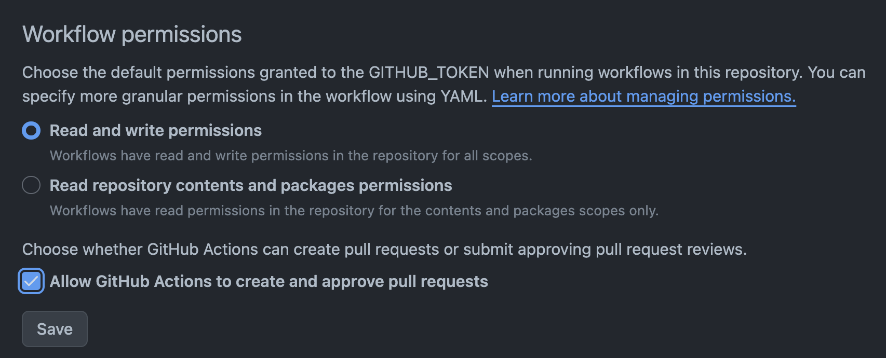

### Local Setup
```bash
brew install n
sudo npm install -g n
sudo n lts
sudo n latest
sudo n prune

sudo npm install -g npm@latest

brew install pnpm
brew install corepack

yarn info yarn description

npm view @astrojs/check version
npm view astro version
npm view firebase-tools version
npm view hotkeypad version
npm view typescript version

pnpm update

❯ pnpm -v
8.15.3
❯ npm -v
10.4.0
❯ node -v
v21.6.1
❯ yarn -v
1.22.21
```

```bash
--- RUN THIS ONLY ---
corepack enable pnpm
corepack prepare pnpm@latest --activate
pnpm install
```

```bash
pnpm build -> debug
pnpm dev -> run locally [Use this while developement]

pnpm preview -> See the final results
```

#### Firebase 
```bash
https://docs.astro.build/en/guides/deploy/google-firebase/

pnpm exec firebase login
pnpm exec firebase experiments:enable webframeworks

❯ pnpm exec firebase init hosting
(node:78290) [DEP0040] DeprecationWarning: The `punycode` module is deprecated. Please use a userland alternative instead.
(Use `node --trace-deprecation ...` to show where the warning was created)

     ######## #### ########  ######## ########     ###     ######  ########
     ##        ##  ##     ## ##       ##     ##  ##   ##  ##       ##
     ######    ##  ########  ######   ########  #########  ######  ######
     ##        ##  ##    ##  ##       ##     ## ##     ##       ## ##
     ##       #### ##     ## ######## ########  ##     ##  ######  ########

You're about to initialize a Firebase project in this directory:

  /Users/himanshujaindev/Documents/MyProject/himanshujain.dev


=== Project Setup

First, let's associate this project directory with a Firebase project.
You can create multiple project aliases by running firebase use --add, 
but for now we'll just set up a default project.

? Please select an option: Use an existing project
? Select a default Firebase project for this directory: himanshujain-dev (himanshujain-dev)
i  Using project himanshujain-dev (himanshujain-dev)

=== Hosting Setup
? Detected an existing Astro codebase in the current directory, should we use this? Yes
? In which region would you like to host server-side content, if applicable? us-west1 (Oregon)
? Set up automatic builds and deploys with GitHub? Yes

i  Detected a .git folder at /Users/himanshujaindev/Documents/MyProject/himanshujain.dev
i  Authorizing with GitHub to upload your service account to a GitHub repository's secrets store.

Visit this URL on this device to log in:
https://github.com/login/oauth/authorize?client_id=89cf50f02ac6aaed3484&state=468433298&redirect_uri=http%3A%2F%2Flocalhost%3A9005&scope=read%3Auser%20repo%20public_repo

Waiting for authentication...

✔  Success! Logged into GitHub as himanshujaindev

? For which GitHub repository would you like to set up a GitHub workflow? (format: user/repository) himanshujaindev/himanshujain.dev

✔  Created service account github-action-758416389 with Firebase Hosting admin permissions.
✔  Uploaded service account JSON to GitHub as secret FIREBASE_SERVICE_ACCOUNT_HIMANSHUJAIN_DEV.
i  You can manage your secrets at https://github.com/himanshujaindev/himanshujain.dev/settings/secrets.

? Set up the workflow to run a build script before every deploy? No

✔  Created workflow file /Users/himanshujaindev/Documents/MyProject/himanshujain.dev/.github/workflows/firebase-hosting-pull-request.yml
? Set up automatic deployment to your site's live channel when a PR is merged? No

i  Action required: Visit this URL to revoke authorization for the Firebase CLI GitHub OAuth App:
https://github.com/settings/connections/applications/89cf50f02ac6aaed3484
i  Action required: Push any new workflow file(s) to your repo

i  Writing configuration info to firebase.json...
i  Writing project information to .firebaserc...

✔  Firebase initialization complete!

pnpm exec firebase deploy --only hosting
```

### GitHub Actions

